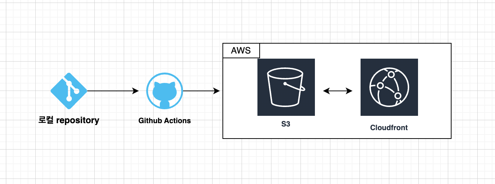

# 프론트엔드 배포 파이프라인

## 개요



다음과 같은 상황에 워크플로우가 실행됩니다.

- main 브랜치에 push가 발생할 때
- GitHub Actions 탭에서 수동으로 실행할 때 (workflow_dispatch)

### 워크플로우 설명

1. GitHub에서 제공하는 최신 버전의 Ubuntu 환경에서 실행합니다.
2. checkout 액션을 통해 레포지토리의 코드를 가상 환경으로 불러옵니다.
3. `npm ci`로 프로젝트 의존성을 설치합니다.
4. 프로덕션용으로 프로젝트를 빌드하고 `out/` 디렉토리에 정적 파일을 생성합니다.
5. AWS 자격 증명을 구성합니다. GitHub Secrets에 저장된 인증 정보를 사용합니다.
6. `out/` 디렉토리의 내용을 S3 버킷과 동기화하고, 새 빌드에 없는 파일을 제거해서 현재 빌드와 동일한 파일만 서비스하도록 합니다.
7. CloudFront의 캐시를 무효화합니다.

## 세팅 절차

1. Next.js 설치

   ```
   npx create-next-app@latest my-app
   ```

2. Git Repository 생성
3. Amazon S3 세팅 / 참고 : https://sprout-log-68d.notion.site/S3-78342f718c3d48b4bda57a11a00ddbf0
4. Amazon Cloudfront 세팅 / 참고 : https://sprout-log-68d.notion.site/CloudFront-2c0653cb130f42b2b21078389511cca2
5. Amazon IAM 세팅 / 참고 : https://sprout-log-68d.notion.site/IAM-87095b5e6ddb4d1990bac9e669cb73f3
6. GitHub Actions
   GitHub 저장소 -> Settings > Secrets and variables > Actions -> New repository secret을 클릭해 밑의 내용을 하나 씩 추가
   `AWS_ACCESS_KEY_ID` : AWS IAM 사용자의 액세스 키 ID
   `AWS_SECRET_ACCESS_KEY` : AWS IAM 사용자의 시크릿 액세스 키
   `AWS_REGION` : AWS 리전 (예: ap-northeast-2)
   `S3_BUCKET_NAME` : 정적 웹사이트 호스팅용 S3 버킷 이름
   `CLOUDFRONT_DISTRIBUTION_ID` : CloudFront 배포 ID
7. GitHub Actions workflows 확인

## 주요 링크

- S3 버킷 웹사이트 엔드포인트: http://hanghae-bucket-test.s3-website-ap-southeast-2.amazonaws.com/
- CloudFront 배포 도메인 이름: https://d368r6mf5d4smv.cloudfront.net/

## 주요 개념

### GitHub Actions과 CI/CD 도구

CI/CD는 `Continuous Integration(지속적 통합)`과 `Continuous Delivery/Deployment(지속적 전달/배포)`의 약자입니다.

1. CI (Continuous Integration)

- 개발자들이 코드 변경사항을 메인 브랜치에 자주 병합하는 방식
- 자동화된 빌드와 테스트로 코드 품질 보장
- 여러 개발자의 코드 충돌을 조기에 발견 및 해결

2. CD (Continuous Delivery/Deployment)
   CD는 두가지의 의미로 사용됩니다.

- Delivery: 프로덕션 배포가 가능한 상태로 만드는 것
- Deployment: 프로덕션 환경까지 자동으로 배포하는 것
- 빠른 배포와 피드백 사이클 가능

GitHub Actions는 다음과 같은 특징을 가집니다.

1. 워크플로우 자동화
   커스텀 이벤트나 스케줄에 따라 실행 가능하고 Git 이벤트(pull request등, push 등)에 반응하여 자동화 합니다.
2. 다양한 운영체제 지원
   가상환경에서 격리되어 실행 가능하도록 운영체제를 지원합니다.
3. 액션의 재사용
   미리 만들어진 액션을 사용 가능합니다.
4. 시크릿과 환경변수
   민감한 정보를 안전하게 관리할 수 있습니다. 환경별로 설정을 분리할 수 있습니다.

린트 검사, 테스트 자동 실행 등을 통한 코드 품질 관리가 가능합니다.

### S3와 스토리지

Amazon S3(Simple Storage Service)는 AWS에서 제공하는 객체 스토리지 서비스입니다.

Amazon S3는 다음과 같은 특징을 가집니다.

1. 정적 웹 호스팅
   HTML, CSS, JavaScript 파일을 호스팅하고, 웹사이트의 엔드포인트를 제공합니다. 또한 Route 53이나 CloudFront를 사용해서 도메인을 연결할 수 있습니다.
2. 데이터 관리
   파일의 여러 버전을 관리(버저닝)할 수 있습니다. 또한 수명 주기를 관리하고 객체를 잠금하는 등의 기능을 통해 효과적으로 데이터를 관리할 수 있도록 도와줍니다.
3. 보안 기능
   버킷의 정책을 설정해서 해당 버킷의 접근 권한을 설정할 수 있습니다. 또한 IAM 사용자별로 권한을 관리할 수 있습니다.

S3 버킷의 웹 호스팅 설정을 위해서는 다음과 같은 절차가 필요합니다.

1. 버킷 생성
   고유한 버킷 이름을 설정하고, 리전을 선택합니다. 정적 웹 호스팅을 위해서는 퍼블릭 액세스 설정이 필요합니다.
2. 정적 웹사이트 호스팅 활성화
   버킷 정책을 설정하여 파일에 대한 공개 접근을 허용합니다.
3. 배포 구성
   현재의 제가 선택한 파이프라인 같은 경우, CloudFront와 연동하여 CDN을 구성하고, SSL/TLS 인증서를 적용할 수 있습니다. 필요한 경우 Route 53을 통해 커스텀 도메인을 설정할 수 있습니다.

### CloudFront와 CDN

Amazon CloudFront는 AWS에서 제공하는 `CDN(Content Delivery Network)` 서비스입니다.

CDN은 다음과 같은 특징을 가집니다.

1. 콘텐츠 캐싱
   전 세계의 엣지 로케이션에 콘텐츠를 캐싱하여 사용자에게 가장 가까운 위치에서 콘텐츠를 제공합니다. (본사가 아니라 가까운 피자집에서 배달 시키기...)
2. 지연 시간 감소
   사용자와 가까운 엣지 로케이션에서 콘텐츠를 제공하므로 지연 시간이 감소합니다.
3. 보안 강화
   SSL/TLS 인증서를 통한 HTTPS 통신을 제공하고, DDoS 공격으로부터 보호합니다.

CloudFront에는 다음과 같은 기능이 있습니다.

1. 배포 설정
   전 세계의 엣지 로케이션에 오리진 설정 (S3, EC2, 커스텀 서버 등), SSL/TLS 인증서 관리, 캐시 동작 설정, 지리적 제한 설정을 통해 사용자에게 가장 가까운 위치에서 콘텐츠를 제공합니다.
2. 캐시 관리
   TTL(Time To Live), 캐시 무효화 (Invalidation), 캐시 키 및 오리진 요청 정책, 압축 설정을 통해 사용자와 가까운 엣지 로케이션에서 콘텐츠를 효율적으로 캐싱하고 제공하므로 지연 시간이 감소하고 성능이 향상됩니다.
3. 보안 기능
   AWS WAF 통합, 필드 레벨 암호화, Signed URLs / Signed Cookies, 오리진 액세스 ID (OAI)를 통해 SSL/TLS 인증서로 HTTPS 통신을 제공하고, DDoS 공격으로부터 보호하며 전반적인 보안을 강화합니다.

### 캐시 무효화(Cache Invalidation)

`캐시 무효화`는 엣지 로케이션에 저장된 캐시된 콘텐츠를 강제로 제거하거나 업데이트하는 프로세스입니다. 오리진 서버의 콘텐츠가 업데이트되었지만, 엣지 로케이션의 캐시에는 여전히 이전 버전의 콘텐츠가 남아있을 때 사용됩니다.
특정 파일 또는 디렉토리에 대한 무효화 요청을 생성합니다. CloudFront는 지정된 파일을 모든 엣지 로케이션에서 제거하거나 새 버전으로 업데이트합니다.

### Repository secret과 환경변수

`Repository Secret`은 코드 저장소(예: GitHub, GitLab)에 안전하게 저장되는 암호화된 환경 변수입니다. API 키, 비밀번호, 토큰 등 민감한 정보를 저장합니다.
암호화되어 저장되며, 저장소 관리자만 접근 가능합니다. 또한 CI/CD 파이프라인에서 안전하게 사용할 수 있습니다. 코드에 직접 노출되지 않아 보안성이 높습니다.

`환경변수`는 운영 체제 수준에서 설정되는 동적 값입니다. 애플리케이션의 구성 정보, 실행 환경 설정 등을 저장합니다.
개발, 테스트, 프로덕션 등 다양한 환경에 따라 다르게 설정할 수 있습니다. 애플리케이션 코드를 변경하지 않고 환경에 따라 다른 설정을 적용할 수 있습니다.
보안 수준이 요구되지 않는 정보를 저장하는 데 주로 사용됩니다.


## CDN 최적화 보고서
- [CDN 최적화 보고서](https://github.com/YeongseoYoon-hanghae/hanghae-bucket-test/blob/main/cdn-optimization-report.md)
