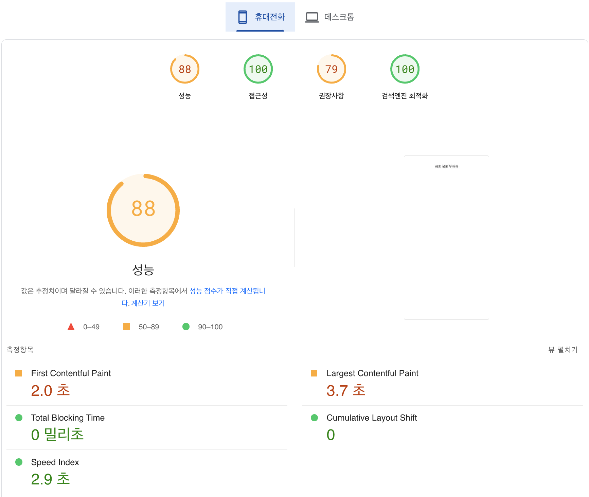
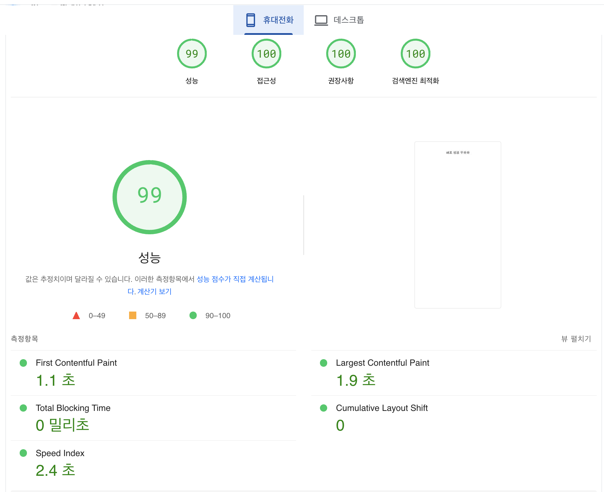

# CDN을 이용한 성능최적화 보고서

## 테스트 목적

CDN(Content Delivery Network)을 이용한 성능 최적화 테스트의 주요 목적은 다음과 같습니다.

1. 라이트하우스 성능 지표 개선
2. 네트워크 속도 최적화
3. 번들 사이즈 최적화

이러한 목적을 통해 CDN 도입의 실질적인 효과를 종합적으로 평가하고, 최적의 설정을 찾아 적용하고자 합니다.

## 테스트 환경

- [S3 버킷 웹사이트 엔드포인트](http://hanghae-bucket-test.s3-website-ap-southeast-2.amazonaws.com/)
- [CloudFront 배포 도메인 이름](https://d368r6mf5d4smv.cloudfront.net/)

## S3와 CloudFront CDN 성능 비교

### LightHouse 측면

#### S3

#### CDN

#### LightHouse 점수 비교

| 항목            | CloudFront | S3    | 차이  |
| --------------- | ---------- | ----- | ----- |
| 성능            | 99점       | 88점  | +11점 |
| 접근성          | 100점      | 100점 | -     |
| 권장사항        | 100점      | 79점  | +21점 |
| 검색엔진 최적화 | 100점      | 100점 | -     |

#### 성능 지표 비교

| 항목                          | CloudFront | S3    | 차이       |
| ----------------------------- | ---------- | ----- | ---------- |
| FCP(First Contentful Paint)   | 1.1초      | 2.0초 | 0.9초 감소 |
| LCP(Largest Contentful Paint) | 1.9초      | 3.7초 | 1.8초 감소 |
| Total Blocking Time           | 0ms        | 0ms   | -          |
| CLS(Cumulative Layout Shift)  | 0          | 0     | -          |
| Speed Index                   | 2.4초      | 2.9초 | 0.5초 감소 |

#### 주요 개선사항

1. 전반적 성능 점수

- CloudFront 사용 시 99점으로 11점 향상
- 특히 권장사항 부분에서 21점 큰 폭 개선

2. 로딩 속도

- 초기 콘텐츠 표시 약 45% 개선
- 전체 콘텐츠 로딩 약 49% 개선

### 네트워크 속도 및 파일 크기

#### S3

#### CDN

| 항목         | CloudFront | S3     | 차이   |
| ------------ | ---------- | ------ | ------ |
| 총 로드 시간 | 135ms      | 1.08초 | -945ms |
| DOM 로드     | 56ms       | 204ms  | -148ms |
| 리소스 크기  | 357KB      | 630KB  | -273KB |

### 주요 성능 차이점

1. 전체 로딩 속도

- CloudFront: 135ms로 매우 빠른 로딩 속도
- S3 직접 호스팅: 1.08초로 상대적으로 느린 속도
- CloudFront 사용 시 약 87.5% 성능 향상

2. 개별 리소스 로딩 시간

- Font 파일:

  - CloudFront: 13-15ms
  - S3: 316-349ms

- JavaScript 파일:
  - CloudFront: 13-21ms
  - S3: 324-855ms

3. 압축 및 최적화

- CloudFront는 더 효율적인 파일 압축을 보여줌
- 전송된 데이터 크기가 약 273KB 절감됨

### 결론

CloudFront CDN 사용 시 다음과 같은 명확한 이점이 확인됩니다.

- 약 8배 빠른 전체 페이지 로드 시간
- 약 4배 빠른 DOM 컨텐츠 로드
- 더 효율적인 리소스 압축과 전송: 특히 큰 파일(폰트, 스크립트)에서 현저한 성능 향상
- LightHouse 성능 점수 향상
- 검색엔진 최적화 유지
